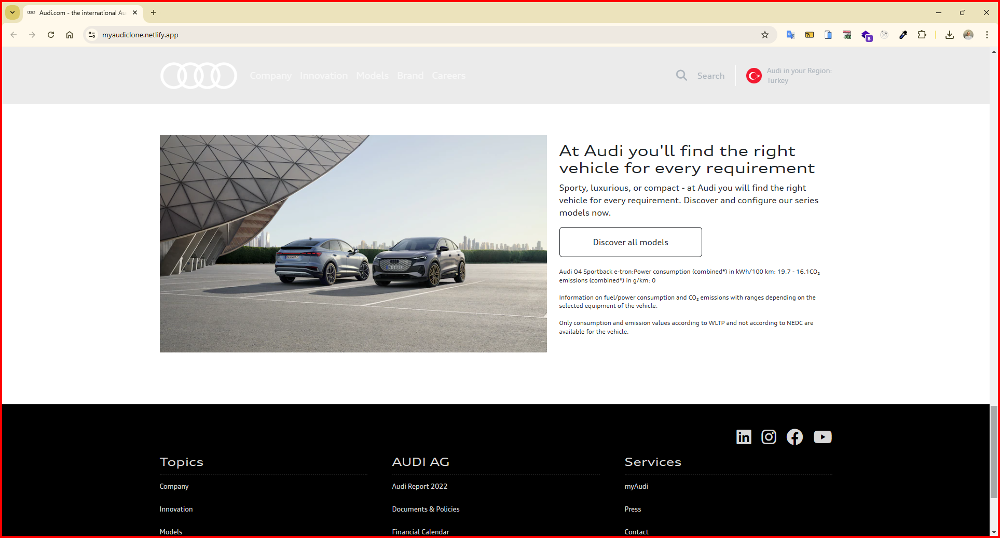

<h1>Audi Clone Website</h1>

I am here with a clone site that captures the design lines of Audi's official website! Discovering Audi products is now much more enjoyable on this site, which I created with HTML5 and CSS3 mastery.

<h2> The following technologies were used in the frontend development phase of my site: </h2>

- HTML5
- CSS3

<h2> Visit My Audi Clone Website: </h2>

- https://myaudiclone.netlify.app/

<h4>IMAGES</h4>

